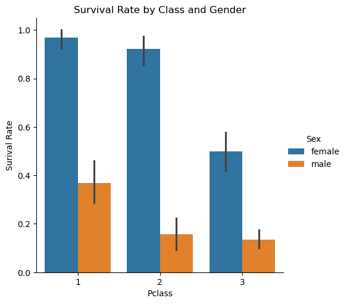

# Titanic Survival — Exploratory Data Analysis & Baseline Prediction


An end-to-end analysis of the [Titanic passenger dataset](https://www.kaggle.com/c/titanic/data),
identifying which passenger characteristics were most associated with
survival, and a baseline machine learning model to predict outcomes from
those characteristics.

## Why This Matters

Beyond the historical dataset, this project demonstrates a workflow that
generalizes to real business problems: given incomplete records on a
population, which attributes actually drive an outcome, and can that
relationship be modeled reliably enough to act on? The same structure
applies to customer churn, credit risk, or employee attrition.

## Project Highlights

- Cleans a real-world dataset with **three different types of missing data**, each handled with a distinct, justified strategy
- Uncovers a clear, statistically strong survival hierarchy across **gender, class, and age**
- Shows how combining two variables (class + gender) reveals a relationship neither shows alone
- Trains and evaluates a **baseline logistic regression model**, achieving 79.89% accuracy
- Confirms EDA findings independently through **model feature importance** — the model "discovers" the same patterns as the manual analysis

## Dataset Overview

- **891 passenger records**, 12 original attributes
- Mix of demographic (`Age`, `Sex`), ticket (`Pclass`, `Fare`, `Embarked`), and family (`SibSp`, `Parch`) data
- Missing values in `Age` (20%), `Cabin` (77%), and `Embarked` (0.2%)

## Approach

**1. Data Cleaning**

| Column | Missing | Strategy | Reasoning |
|--------|---------|----------|-----------|
| `Age` | 177 (20%) | Filled with median (28.0) | Too much data to drop; median is robust to outliers |
| `Embarked` | 2 (0.2%) | Filled with mode ("S") | Negligible missing count, safe majority-class fill |
| `Cabin` | 687 (77%) | Dropped entirely | Insufficient data to impute reliably |

**2. Exploratory Data Analysis**
Examined survival rate across gender, passenger class, age group, and
combinations of these — moving from single-variable to interaction effects.

**3. Baseline Modeling**
Encoded categorical features, trained a logistic regression classifier,
and evaluated it on a held-out test set, including feature importance
to cross-check EDA conclusions.

## Key Findings

- Overall survival rate was **38.4%** (342 of 891 passengers) — the baseline every other number is compared against
- **Gender was the dominant factor**: women survived at **74.2%** vs. **18.9%** for men, a ~4x gap
- **Class mattered independently**: survival fell from **63.0%** (1st) → **47.3%** (2nd) → **24.2%** (3rd)
- **The two factors interact**: 3rd class women (50.0%) still outsurvived 1st class men (36.9%) — gender outweighed class, but class still mattered heavily within each gender
- **Children had a measurable advantage**: 58.0% survival vs. 22.7% for seniors (60+), consistent with "women and children first"



## Model Results
A baseline Logistic Regression model was trained using passenger class, sex, age, family relationships, fare, and embarkation port as predictors. The model achieved 79.89% accuracy on the held-out test set.

| Metric | Value |
|--------|-------|
| Accuracy | **79.89%** |
| Precision (Survived) | 0.77 |
| Recall (Survived) | 0.73 |
| F1-score (Survived) | 0.75 |

**Feature importance** (logistic regression coefficients):

| Feature | Coefficient | Direction |
|---------|-------------|-----------|
| Sex | +2.58 | Strongly increases survival odds (female) |
| Embarked | +0.22 | Minor positive effect |
| Fare | +0.003 | Negligible effect |
| Age | -0.03 | Slight negative effect |
| Parch | -0.10 | Slight negative effect |
| SibSp | -0.30 | Moderate negative effect |
| Pclass | -0.96 | Strong negative effect (higher class number = lower odds) |

**Observation:** `Sex` and `Pclass` emerged as by far the strongest predictors —
independently confirming the EDA findings rather than just restating them.

## Key Learnings

- Choosing an imputation strategy (median vs. drop vs. mode) is a judgment
  call that depends on how much data is missing, not a one-size-fits-all rule
- Single-variable analysis can hide interaction effects — the class × gender
  breakdown revealed a relationship neither variable showed alone
- A model's feature importance is a useful sanity check against manual EDA
  conclusions, not just a modeling output

## Future Improvements

- Engineer new features from `Name` (title extraction: Mr./Mrs./Master) and
  family size (`SibSp` + `Parch`)
- Compare logistic regression against tree-based models (Random Forest,
  Gradient Boosting) for potential accuracy gains
- Add cross-validation instead of a single train/test split for a more
  robust accuracy estimate

## Installation

Clone the repository:
```bash
git clone https://github.com/charu90791/titanic-eda.git
cd titanic-eda
```

Install the required packages:
```bash
pip install -r requirements.txt
```

## How to Run

**Notebook** (full exploration with inline charts and commentary):
```bash
jupyter notebook notebook/titanic_eda.ipynb
```

**Script** (clean end-to-end pipeline, run from the project root):
```bash
python src/titanic_eda.py
```
Expects `data/train.csv` to be present; saves the survival chart to `outputs/`.

## Project Structure

```
titanic-eda/
├── data/
│   └── train.csv
├── notebook/
│   └── titanic_eda.ipynb
├── src/
│   └── titanic_eda.py
├── outputs/
│   └── survival_by_class_gender.png
├── requirements.txt
└── README.md
```

## Tech Stack

- **Python** — pandas, NumPy
- **Visualization** — Matplotlib, Seaborn
- **Machine Learning** — scikit-learn (LogisticRegression, train_test_split, classification metrics)
